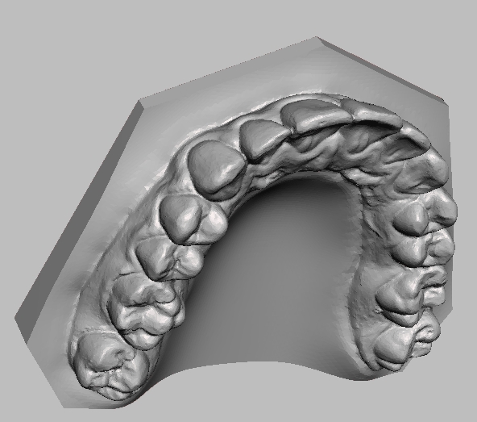
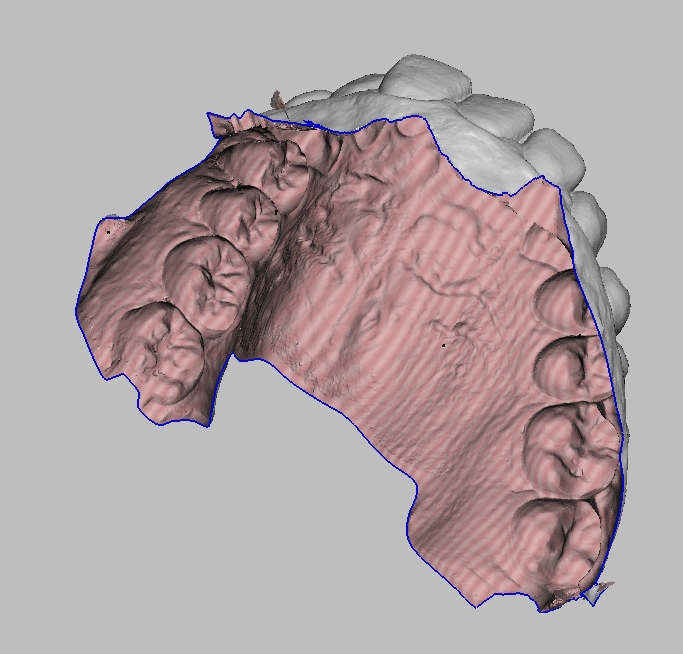

# How to 3D print a digital dental model (updated 08/23/2023)

This instruction is created for residents in the Division of Orthodontics at the Ohio State University. If you have any questions, please feel free to reach out to the 3D printing engineer in the division.

# Outline

In this instruction, we will demonstrate how to

 - Export the digital file (STL file) from iTero (Step 2),
 - 3D print those files (Steps 3-5)
 - Process the digital file to be printable using Meshmixer (Optional Step),
 
# Equipment and Software
 - 3D printer: RayShape Shape 1+ (stereolithography)
 - Slicing software: ShapeWare
 - Printing material: Rayshape Model (resin)
 - (optional) Mesh processing software: Meshmixer (free software)

## Step 1. Intraoral scanning

The intraoral scan we have in our graduate ortho clinc is iTero element 5D Plus. To learn how to conduct an intraoral scan, please ask our dental assistants.
When you plan to 3D print the model, please remember which scanner you used. The way to export digital files (STL files) are different (see Step 2).

## Step 2. Export the intraoral scan

Go to https://bff.cloud.myitero.com/login and log in, and then follow the video below.

Please contact the staffs if you need the login information.

## Step 3. Submit a job to 3D printer

Once the STL file you plan to print is ready, you can import the STL files into the slicing software (i.e., ShapeWare here). Please see the video below to learn the basic operation.
The video below will show you how to conduct a horizontal printing.
There are two different types of printing direction: horizontal and vertical. Please see the corresponding videos below.

## Step 4. 3D printing

 1. Turn on oxygen generator
 2. Check amount of resin in material tray
 3. Shaking and pour more resin into material tray
 4. Well mix resin in material tray
 5. Print

## Step 5. Post-process 3D printed models

Follow the video below.

## Optional Step. Process the digital file

Basically, there are two types of intraoral scans:

|Type|Example|Printable|
|--|--|--|
|Scan with a base (closed surface)||Yes|
|Scan without a base (open surface)||No|
 
 
Please see the corresponding video to learn how to process the intraoral scan that you plan to print.

|Type|Tutorial|Level|
|--|--|--|
|Scan with a base (closed surface)||Basic|
|Scan without a base (open surface)||Basic|
|Make a shell model|| Advanced|
|Make a vertical printable model||Advanced|