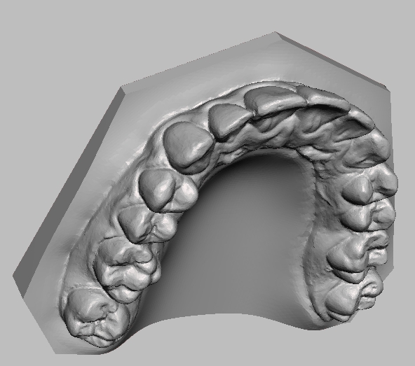
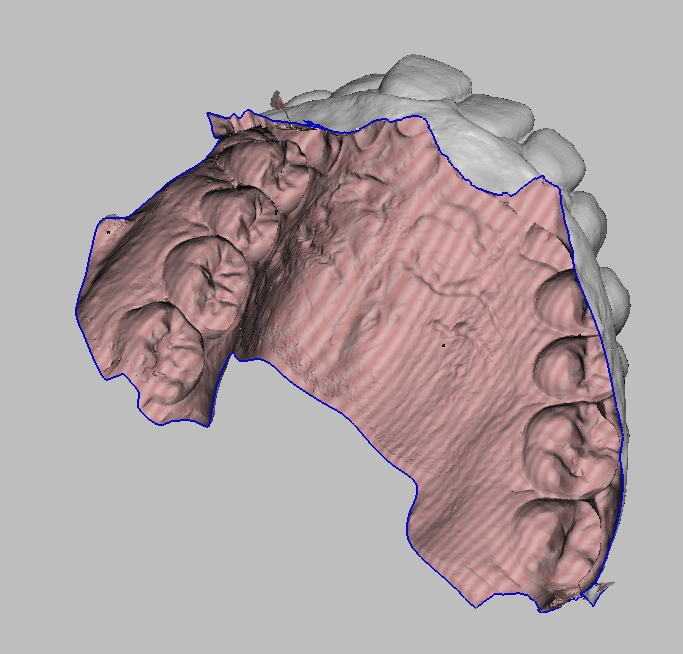

# How to 3D print a digital dental model
# Updated by 06/22/2026
This instruction is created for residents in the Division of Orthodontics at The Ohio State University. If you have any questions, please feel free to reach out to the 3D printing engineer in the division.

# Outline
In this instruction, we will demonstrate how to:

 - Export the digital file (STL file) from iTero (Step 1)
 - 3D print a STL file (Steps 2-4)
 - Additional information
 
# Equipment and Software
 - 3D printer: Formlabs Form 4B (PoshAlligator) (stereolithography)
 - Slicing software: PreForm
 - Printing material: Desktop Health Model Z (resin)

## Step 0. Intraoral scanning

The intraoral scanner we have in our graduate ortho clinc is iTero element 5D Plus. To learn how to conduct an intraoral scan, please ask our dental assistants.
The way to export digital files (STL files) are different (see Step 1).

## Step 1. Export an intraoral scan

Go to https://bff.cloud.myitero.com/login and log in, and then follow the video below.

Please contact the senior residents or staffs if you need the login information.

## Step 2. Submit a job to 3D printer

Once the STL file you plan to print is ready, you can import the STL files into the slicing software (i.e., PreForm).
There are two different types of printing directions: horizontal and vertical. Please see the "Additional Information" section at the end of this instruction for more details.
In most scenarios in the graduate clinic, we will perform horizontal printing.
Please see the video below, which showing you how to conduct horizontal printing.

## Step 3. Start a job on 3D printer

What you need to do depends on the option you chose in Step 2:

 - **If you selected "Print Now":** You basically don't need to do anything in this step. The Form 4B will automatically mix the resin and refill the tank if there isn't enough resin.
 - **If you selected "Upload to Queue":** Find your job on the printer, then press the Play button to start it.

 You can also follow the video below.
 
 <!---->

## Step 4. Post-process 3D printed model(s)

Follow the video below.

## Additional information

# Printability
To determine if an STL file is printable, we need to check if the 3D object is watertight. Only watertight 3D objects can be printed. Below are two examples:

|Type|Example|Printable|
|--|--|--|
|Scan with a base (watertight)||Yes|
|Scan without a base (non-watertight)||No|
 
 # Printing Direction
In dental 3D printing, two common printing directions are defined: horizontal and vertical. Their pros and cons are summarized in the table below:
|Type|Pros|Cons|
|--|--|--|
|Horizontal|1. Faster 2. More accurate    |Fewer models can be printed in a single job|
|Vertical|More models can be printed in a single job|1. Longer printing time for a job 2. More overhang, sometimes causing accuracy issues|

